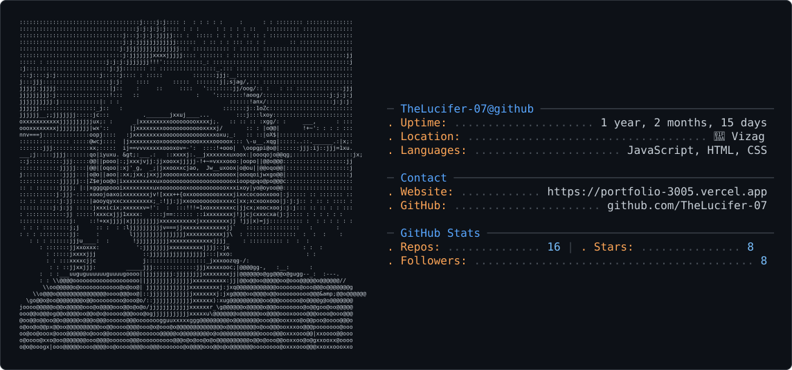

# Hemachandu Animireddy

### Full-Stack Developer | AI & Data Science Student

Building scalable applications and solving real-world problems with clean, efficient code.

 

<picture>
  <source media="(prefers-color-scheme: dark)" srcset="dark_mode.svg">
  <source media="(prefers-color-scheme: light)" srcset="light_mode.svg">
  
</picture>

---

## 👋 About Me

I'm a Full-Stack Developer and AI & Data Science student focused on building real-world applications.

- Scalable full-stack development
- Data Structures & Algorithms
- AI-powered applications

---

## 🛠️ Tech Stack

**Languages:** Java • Python • JavaScript • HTML • CSS

**Frontend:** React • Tailwind CSS

**Backend:** Node.js • Express

**Database:** MongoDB • Firebase

**Tools:** Git • VS Code • Vercel • Render

---

## 🏆 Achievements

- ⭐⭐⭐ CodeChef — Rating: 1600
- Strong foundation in Data Structures & Algorithms
- Competitive programming

---

<i>"Code is where logic meets creativity."</i>

